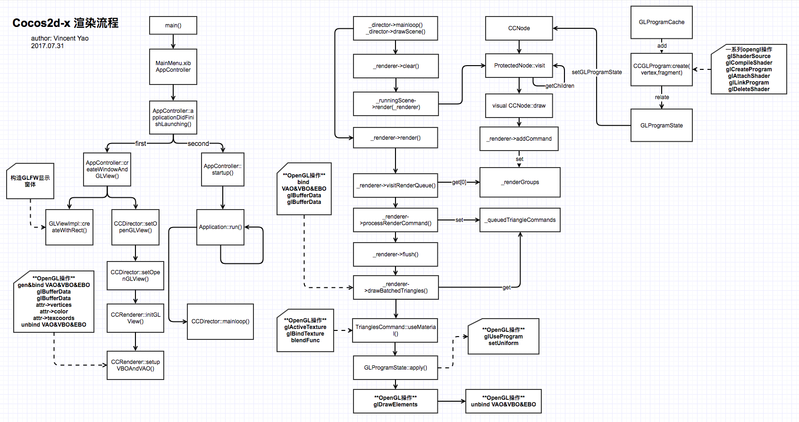

# Dinky2D
### 介绍
这是一个仿造cocos引擎编写的超精简2D游戏引擎，该引擎仅用于：
* 学习cocos2d-x引擎结构
* 学习OpenGL

### 进度
| 目标     | 是否完成 | 备注            |
| ------ | ---- | ------------- |
| 基本渲染流程 | √    | 包括图片渲染        |
| 基本矩阵变换 | √    | 坐标，缩放，旋转，节点层次 |
| 定时器    | ×    |               |
| 动作     | ×    |               |
| 文本渲染   | ×    |               |
### 附录
个人总结的cocos2d-x渲染流程
  
