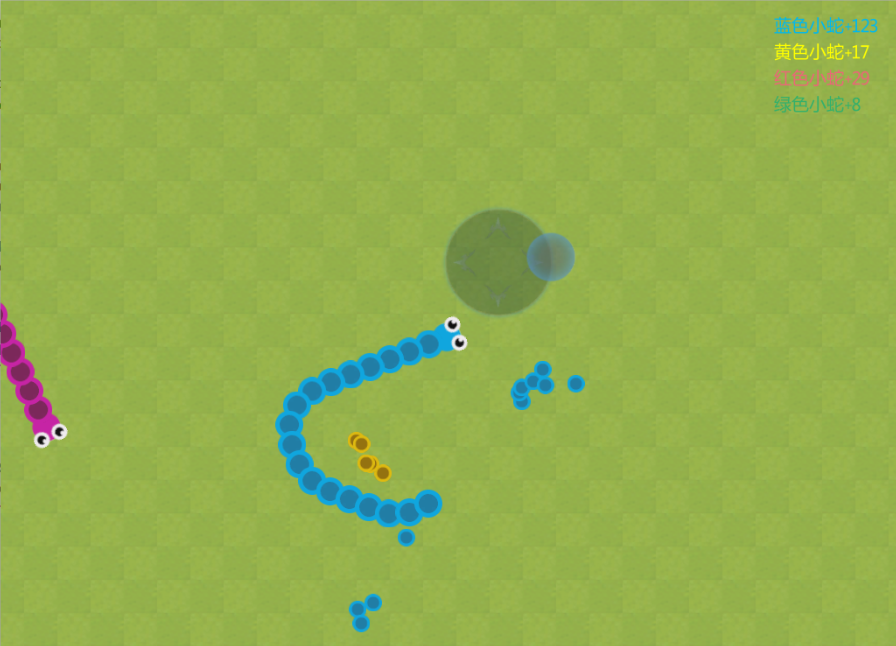

# Dinky2D

## 介绍

**这是一款超精简的2D非商业游戏引擎。**

引擎结构参考知名2D游戏引擎 **[cocos2d-x](https://github.com/cocos2d/cocos2d-x)**

您可以使用它：

* 制作小游戏
* 学习游戏引擎
* 学习OpenGL
* 学习贪吃蛇 ：）
## 进度
**目前只支持xcode下的mac工程，windows工程尚未配置** *(欢迎PR)*。
| 目标     | 是否完成 | 备注                   |
| ------ | :--: | -------------------- |
| 基本渲染流程 |  ✔️  | TODO: 渲染批次合并问题       |
| 基本矩阵变换 |  ✔️  | 坐标，缩放，旋转，锚点，层次       |
| Node   |  ✔️  | 颜色，可见度，透明度           |
| Sprite |  ✔️  | 加载图片，纹理渲染            |
| Layer  |  ✔️  | 自定义颜色                |
| 定时器    |  ✔️  | 绑定在Node上，可自动释放       |
| 键盘输入   |  ✔️  | 代理模式，IMEDelegate     |
| 鼠标输入   |  ✔️  | 代理模式，TouchDelegate   |
| Label  |  ✔️  | TODO:对齐操作，自动换行操作     |
| Demo   |  ✔️  | 石乐志的AI，简单的碰撞检测 - 贪吃蛇 |

## Demo截图

## 作者

Vincent Yao, ookcode@gmail.com

## 协议

Dinky2D 基于 MIT 协议进行分发和使用，更多信息参见协议文件。
